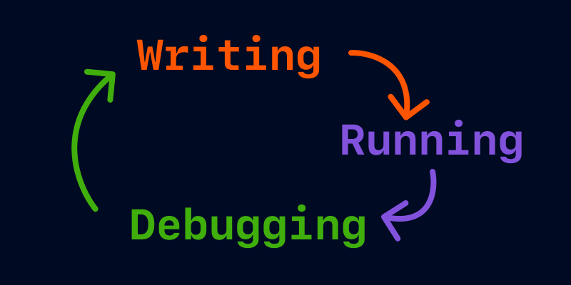

# Python


## Writing Code
- 🌟 humans use code to give `instructions` to machines
- 🌟 the `print()` instruction displays a message on the screen.
```
print("Welcome")
```

## Memory & Variables
- Computer programs use `variables` to remember important information, like items in a shopping cart, prices and discounts.
- The line of code below tells the computer to store information in a variable called item.
- Variables have a name and a value. To create a variable, you just need to give it a name, then connect the name with the value you need to store using the equal sign =.
```
item = "bike"
company = "Google"
device = "Ipad"
message = "Level Up"
job = "designer"
```

## Text Data
- 🌟 A piece of text is called a `string`

- 🌟 Strings require `quotation marks`

- 🌟 The `print()` statement is used to send a value to the screen.
```
"The Lord of the rings"
company = "Apple"
month = 'April'
print("Welcome to the Code Playground")
```

## Numerical Data
- 🌟 Numerical values can be stored in variables

- 🌟 You can access the value stored in a variable by calling its name

- 🌟 Numerical data should not be surrounded by quotation marks.
```
population = 25000
pages = 310
print(280)
print(7 + 3)
print(10 - 5)
print(5 * 3)
print(10 / 2)
```

## Working with Variables
🌟 You can run calculations using the values stored in variables

🌟 You can store the result of a calculation in a variable

🌟 Updating the value of a variable is called reassigning a variable.
```
size = "medium"
age = 34

price = 150
print(price)

budget = 20
print(budget + 10)

price = 5
amount = 3
print(price * amount)

# reasigning a variable
points = 35
points = 45
print(points)
```

## Debugging


🌟 Errors in code are known as bugs

🌟 Code is executed line by line from top to bottom

🌟 Code execution is interrupted by bugs.

## Standards and Best Practices
🌟 You can add comments to your code with the hash symbol #

🌟 Python is a `case-sensitive` language

🌟 `Snake case` is the best practice when creating multi-word variable names.