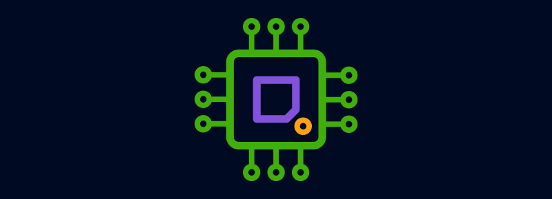
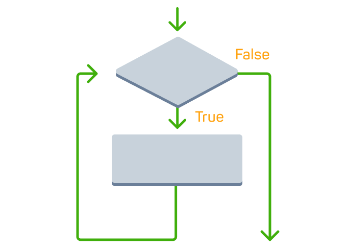

# Python


## Writing Code
- 🌟 humans use code to give `instructions` to machines
- 🌟 the `print()` instruction displays a message on the screen.
```
print("Welcome")
```

## Memory & Variables
- Computer programs use `variables` to remember important information, like items in a shopping cart, prices and discounts.
- The line of code below tells the computer to store information in a variable called item.
- Variables have a name and a value. To create a variable, you just need to give it a name, then connect the name with the value you need to store using the equal sign =.
```
item = "bike"
company = "Google"
device = "Ipad"
message = "Level Up"
job = "designer"
```

## Text Data
- 🌟 A piece of text is called a `string`

- 🌟 Strings require `quotation marks`

- 🌟 The `print()` statement is used to send a value to the screen.
```
"The Lord of the rings"
company = "Apple"
month = 'April'
print("Welcome to the Code Playground")
```

## Numerical Data
- 🌟 Numerical values can be stored in variables

- 🌟 You can access the value stored in a variable by calling its name

- 🌟 Numerical data should not be surrounded by quotation marks.
```
population = 25000
pages = 310
print(280)
print(7 + 3)
print(10 - 5)
print(5 * 3)
print(10 / 2)
```

## Working with Variables
🌟 You can run calculations using the values stored in variables

🌟 You can store the result of a calculation in a variable

🌟 Updating the value of a variable is called reassigning a variable.
```
size = "medium"
age = 34

price = 150
print(price)

budget = 20
print(budget + 10)

price = 5
amount = 3
print(price * amount)

# reasigning a variable
points = 35
points = 45
print(points)
```

## Debugging


🌟 Errors in code are known as bugs

🌟 Code is executed line by line from top to bottom

🌟 Code execution is interrupted by bugs.

## Standards and Best Practices
🌟 You can add comments to your code with the hash symbol #

🌟 Python is a `case-sensitive` language

🌟 `Snake case` is the best practice when creating multi-word variable names.

## Applying Best Practices
🌟 spaces are not allowed in variable names

🌟 a variable name cannot start with a number

🌟 best practices can help you avoid errors.
```
account_balance = 350
print(account_balance)

format = "mp3"
print(format)

device_type = "Ipad"
print(device_type)

salary = 900
new_salary = salary + 200
print(new_salary)
```

## Inputs and Outputs
🌟 inputs and outputs help machines communicate with the outside world

🌟 the input() instruction allows the user to enter a value into your program

🌟 the print() instruction is used to generate an output.
```
message = input()
print(message)

user_entry = input() # asks the user for a value that gets stored in a variable called user_entry
```

## Data Types
🌟 `data types` tell computers how to store, process and operate different types of data

🌟 `string` is the data type for text

🌟 `integer` and `float` are data types for numbers.
```
# String - surrounded by quotation marks
item = "Nintendo"

# Integers - numbers (positive, negative or zero)
item = 2

# Float - numbers with decimal places (they can be positive or negative)
item = 3.14
variable = 5/2 # stores 2.5

print(3 + 5) # => 8
print("Iron" + "Man") # => IronMan
```

## Data Type Checking
🌟 the `type()` instruction is used to check the data type

🌟 the division of two integers always produces a `float`.
```
city = "Berlin" #stores a string
age = 42 #stores an integer
balance = 830.29 #stores a float
print(type(city)) #outputs <class 'str'>
print(type(age)) #outputs <class 'int'>
print(type(balance)) #outputs <class 'float'>
```
## Data Conversion
🌟 you can change the data type of a value with `int()`, `float()` and `str()`

🌟 there are `implicit` and `explicit` data type conversions in Python

🌟 str(), int(), float() instructions are explicit conversions.
```
birth_year = input()
print(type(birth_year)) # => <class 'str'>

x = "55" #x is a string
y = int(x) #y is an integer

height = int(input())

a = 3
b = float(a)
print(b) # => 3.0
```

## Comparison Operations


🌟 the Boolean data type has one of two possible values: True or False

🌟 a comparison operation always results in a Boolean.
```
# the result of comparison operators is either "True" or "False"
print(30 < 25)
print(5 < 9)
print(50 > 100)

# Boolean is a data type that has one of two possible values: True or False.
print(type(5 < 9))
print(type(50 > 100))
```

## Logical Operations
🌟 take multiple Boolean values as input

🌟 produce a single Boolean value as output

🌟 "and" and "or" are examples of logical operations.
```
print(True and False)
print(False and True)
print(True or False)
print(False or True)
```

## Combining Comparison and Logical Operations
🌟 You can store boolean values in variables

🌟 You can store the result of logical and comparison operations in variables

🌟 You can combine operations with logical and comparison operators.
```
light_on = True
door_locked = False
print(light_on or door_locked)

temp = 35
ac_on = temp > 30
print(ac_on)

a = (3 > 2) or False
```
## Control Flow
🌟 you use `sequencing`, `iteration` and `selection` to control the flow of instructions

🌟 an `algorithm` is a set of step-by-step instructions to complete a task

🌟 `algorithm`s can be represented in different ways.
```
# sequencing- It means that the computer will run your code in order, one line at a time from the top to the bottom.
print("3")
print("building")
print("blocks")

# Iteration- is about executing a number of instructions repeatedly. Iteration is commonly represented as a loop.

# Selection- chooses what path a program takes

# An algorithm- is a set of step-by-step instructions placed in the correct  order to complete a task.

# A flowchart- will help you to visualize an algorithm.

# Another way to represent an algorithm is with pseudocode. Pseudocode is a simplified language that is a bit closer to a programming language.
```

## For Loops


🌟 you can implement iteration into your programs with the for loop

🌟 the initial loop statement must be followed by a colon : symbol

🌟 the code that gets repeated must be indented. 
```
#Define the number of iterations
for i in range(3):
  #Statement that gets repeated
  print("Hello") # => prints Hello 3x

for i in range(100):
  print("Hello") # => prints Hello 100x

for i in range(10):
  print(i) # => prints 0 - 9

for i in range(5):
    print("Congrats!") # => prints Congrats! 5x

for num in range(5):
print("Coding is fun!") # => prints error bcz-the code that gets repeated must be indented

for num in range(6)
  print(num) # => prints error bcz-missing colon : symbol
```

## While Loops
🌟 you can implement iteration into your programs with the `while loop`

🌟 `counters` keep track of the number of iterations and avoid infinite loops

🌟 `indentation` and the `colon : symbol` are required for the code to run.
```
seats = 500 # initial number of seats
while seats > 0: # seat available?
  print("Sell ticket") # ticket sold
  seats = seats - 1 # number of seats updated
```

## Conditional Statements
🌟 if-else statements are used to implement selection into your programs

🌟 the colon : symbol and the use of indentation are needed to prevent errors.
```
#sets the value of age
age = 22
if age >= 18:
  # executed only if customer is over-age
  print("Regular price") 
else:
  #executed only if age is less than 18
  print("Discount")

age = 30
if age >= 18:
  print("Regular price")
else:
  print("Discount")
print("Proceed to payment")

is_student = False
age = 16
print(is_student and (age < 18))

age = 32
is_student = True
if age < 18 or is_student:
  print("Discount")
else: 
  print("Regular price")

age = 75
if age < 18: 
  print("Junior discount")
elif age >= 75: 
  print("Senior discount")
else:
  print("No discount")
print("Proceed to payment")
```
## Lists
```
# Lists are used to store items. 
# We can create a list by using square brackets with commas separating items. Like this:
# If you want to access a certain item in the list, you can do this by using its index in square brackets.
words = ["Hello", "world", "!"]
print(words[0])
print(words[1])
print(words[2]) 

# Lists can hold different data types, such as strings and numbers.
x = ["a", "b", "c"]
y = [1, 2, 3, 4, 5]

print(x[1])
print(y[3])

# we can use nested lists to represent 2D grids, such as matrices
m = [
    [1, 2, 3],
    [4, 5, 6]
    ]

# To access the elements of a matrix, we specify the row and the column of the item using square brackets:
m = [
    [1, 2, 3],
    [4, 5, 6]
    ]
    
print(m[1][2]) # => 6

# Strings can be indexed like lists too!
str = "Hello world!"
print(str[6]) # => w
```